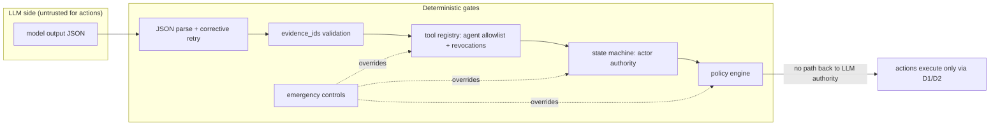
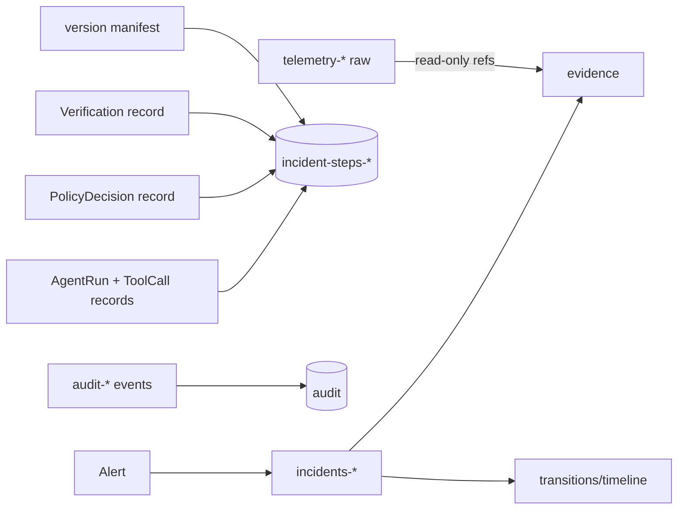

# Aegis Architecture Diagrams

Mermaid; render in GitHub/VS Code.

## Component graph

```mermaid
graph TB
    subscript=none
    subgraph Ingestion
        A[Alert / API POST /incidents] --> ING[ingest_alert]
    end
    subgraph Privacy[Privacy layer - §10]
        PF[classify + redact + allowlist]
    end
    subgraph Reasoning[AI agents - propose only]
        A1[A1 Triage] --> A2[A2 Investigation] --> A3[A3 Correlation] --> A4[A4 Threat] --> A5[A5 Planner]
    end
    subgraph Deterministic controls
        SM[state machine<br/>actor authority]
        PE[policy engine<br/>ALLOW/APPROVE/DENY]
        EX[D1 executor]
        VF[D2 verifier]
    end
    subgraph Data
        ES[(Elasticsearch:<br/>incidents / steps / audit)]
        TL[(telemetry-*<br/>winlogbeat + synthetic)]
    end
    subgraph Intel
        AT[ATT&CK subset]
        TI[TI store]
        CO[correlation]
    end

    ING --> SM
    SM --> A1
    PF -.-> A1 & A2 & A4
    A2 -- "registry-gated read tools" --> TL
    A4 -- lookup_ip/hash/domain --> TI
    A3 --> CO
    AT -.-> A4
    A5 -- recommendation --> PE
    PE -- ALLOW/APPROVE --> SM
    PE -- DENY --> SM
    SM -- AUTHORIZED --> EX
    EX --> VF
    VF -- RESOLVED/REOPENED/ESCALATED --> SM
    SM <--> ES
    EX & VF & PE & A1 & A2 & A3 & A4 & A5 -. audit events .-> ES
```

## Incident state machine (§12)

```mermaid
stateDiagram-v2
    [*] --> NEW: ingest
    NEW --> TRIAGING: orchestrator
    TRIAGING --> INVESTIGATING
    INVESTIGATING --> CORRELATING
    CORRELATING --> ASSESSING
    ASSESSING --> RESPONSE_PLANNED
    RESPONSE_PLANNED --> AWAITING_APPROVAL: policy APPROVE
    RESPONSE_PLANNED --> AUTHORIZED: policy ALLOW
    AWAITING_APPROVAL --> AUTHORIZED: operator approve
    AWAITING_APPROVAL --> RESOLVED: operator dismiss
    AUTHORIZED --> EXECUTING: D1 via registry gate
    EXECUTING --> VERIFYING: D1 done
    VERIFYING --> RESOLVED: D2 pass
    VERIFYING --> REOPENED: D2 fail (< max retries)
    REOPENED --> INVESTIGATING
    VERIFYING --> ESCALATED: D2 fail (>= max retries)
    state FAILED {
    }
    RESPONSE_PLANNED --> FAILED: policy DENY
    note right of ESCALATED
        Any state -> ESCALATED / FAILED
        (fail-safe, orchestrator/operator only)
    end note
```

## Trust boundaries — what the LLM can and cannot do



## Data flow (§19 L.3)


